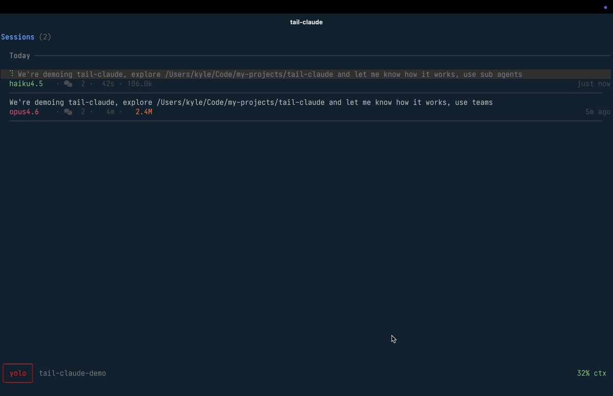

# tail-claude

A terminal UI for reading Claude Code session JSONL files. Built with Go and [Bubble Tea](https://github.com/charmbracelet/bubbletea).

Reads session logs from `~/.claude/` and renders them as a scrollable conversation with expandable tool calls, token counts, and live tailing.

<p align="center">
  
</p>

## Requirements

- Go 1.25+
- A [Nerd Font](https://www.nerdfonts.com/) patched terminal font

## Install

```bash
go install github.com/kylesnowschwartz/tail-claude@latest
```

Or build from source:

```bash
git clone git@github.com:kylesnowschwartz/tail-claude.git
cd tail-claude
go build -o tail-claude .
```

## Usage

Run `tail-claude` to open the most recent session. If the session is stale (>12 hours), the session picker opens instead.

Pass a path directly to skip discovery:

```bash
tail-claude ~/.claude/projects/-Users-kyle-Code-foo/session.jsonl
```

### CLI flags

```
tail-claude [flags] [session.jsonl]
  --dump          Print rendered output to stdout (no interactive TUI)
  --expand        Expand all messages (use with --dump)
  --width N       Set terminal width for --dump output (default 160, min 40)
```

### Keybindings

`?` toggles keybind hints in any view. `Ctrl+z` suspends the TUI (resume with `fg`).

**List view**

| Key | Action |
|-----|--------|
| `j` / `k` | Move cursor down / up |
| `↑` / `↓` | Scroll viewport 3 lines |
| `J` / `Ctrl+d` | Page down (half page) |
| `K` / `Ctrl+u` | Page up (half page) |
| `G` / `g` | Jump to last / first message |
| `Tab` | Toggle expand/collapse current message |
| `e` / `c` | Expand / collapse all Claude messages |
| `Enter` | Open detail view |
| `d` | Open debug log viewer |
| `t` | Open team task board (when teams exist) |
| `y` | Copy session JSONL path to clipboard |
| `O` | Open session JSONL in `$EDITOR` |
| `s` / `q` / `Esc` | Open session picker |
| `Ctrl+c` | Quit |

**Detail view**

| Key | Action |
|-----|--------|
| `j` / `k` | Next / previous item (or scroll) |
| `↑` / `↓` | Scroll viewport 3 lines |
| `J` / `Ctrl+d` | Page down |
| `K` / `Ctrl+u` | Page up |
| `G` / `g` | Jump to last / first item |
| `Tab` | Toggle expand/collapse current item |
| `Enter` | Drill into subagent trace / toggle expand |
| `q` / `Esc` | Back to list (or pop subagent stack) |
| `Ctrl+c` | Quit |

**Debug log viewer**

| Key | Action |
|-----|--------|
| `j` / `k` | Move cursor down / up |
| `↑` / `↓` | Scroll viewport 3 lines |
| `J` / `Ctrl+d` | Page down |
| `K` / `Ctrl+u` | Page up |
| `G` / `g` | Jump to last / first entry |
| `Tab` | Expand/collapse multi-line entry |
| `f` | Cycle level filter: All / Warn+ / Error |
| `/` | Text filter (type to search, Enter to commit, Esc to cancel) |
| `y` | Copy debug log path to clipboard |
| `O` | Open debug log in `$EDITOR` |
| `q` / `Esc` | Clear text filter (first press) / back to list |
| `Ctrl+c` | Quit |

**Session picker**

| Key | Action |
|-----|--------|
| `j` / `k` / `↑` / `↓` | Navigate sessions |
| `G` / `g` | Jump to last / first session |
| `Tab` | Toggle preview expansion |
| `b` | Toggle worktree sessions (when worktrees exist) |
| `Enter` | Open selected session |
| `q` / `Esc` | Back to list |
| `Ctrl+c` | Quit |

## Development

Requires [just](https://github.com/casey/just) for task running.

```bash
just check    # build + vet + staticcheck
just test     # run tests
just run      # build and launch TUI
just race     # build with race detector
just dump     # render latest session to stdout
just release  # tag, push, create GitHub release
```

## Attribution

Parsing heuristics ported from [claude-devtools](https://github.com/matt1398/claude-devtools). See [ATTRIBUTION.md](ATTRIBUTION.md).

## License

[MIT](LICENSE)
