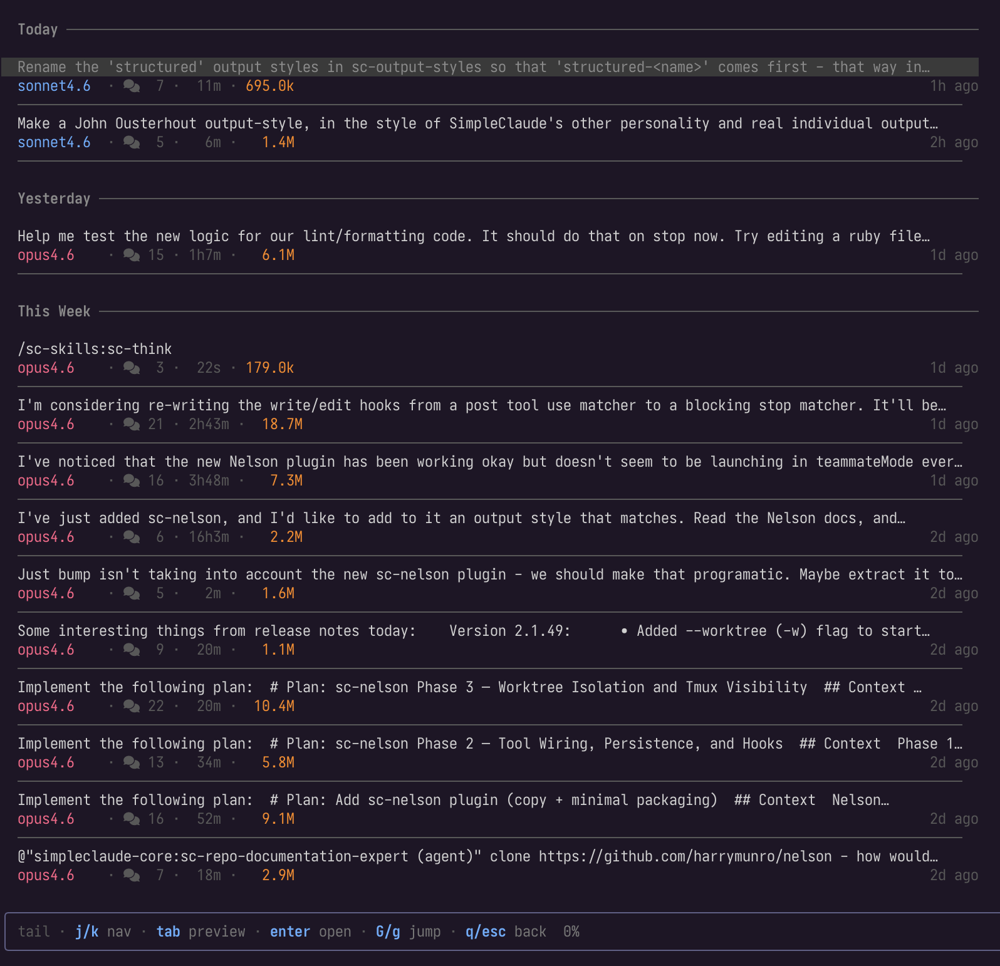
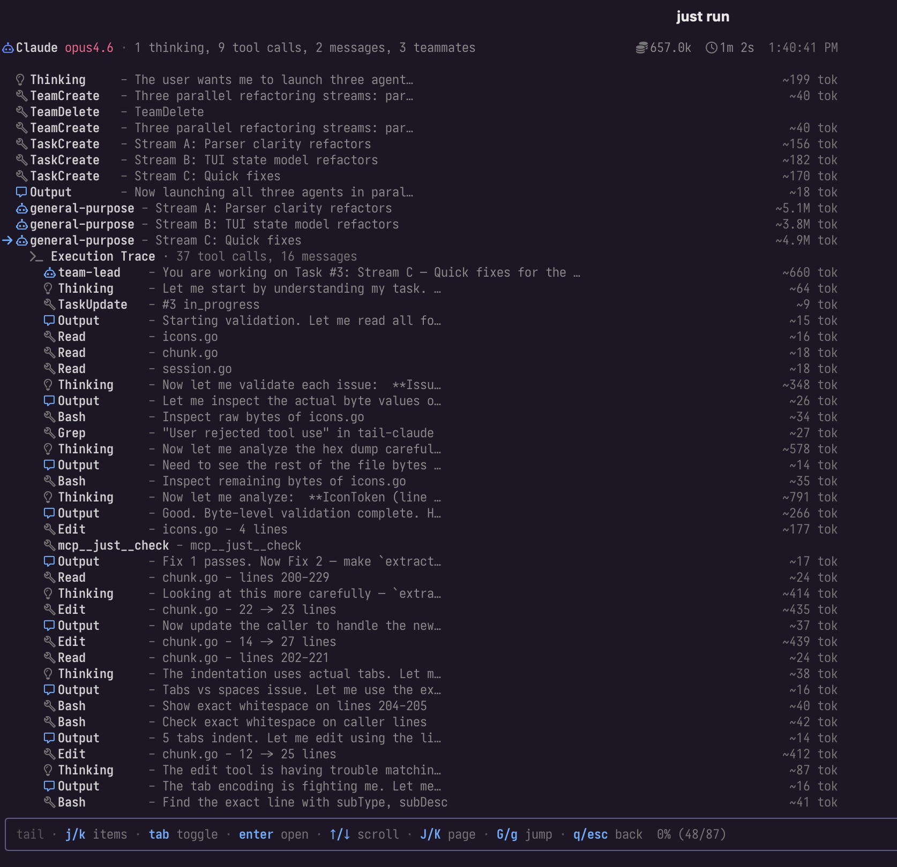
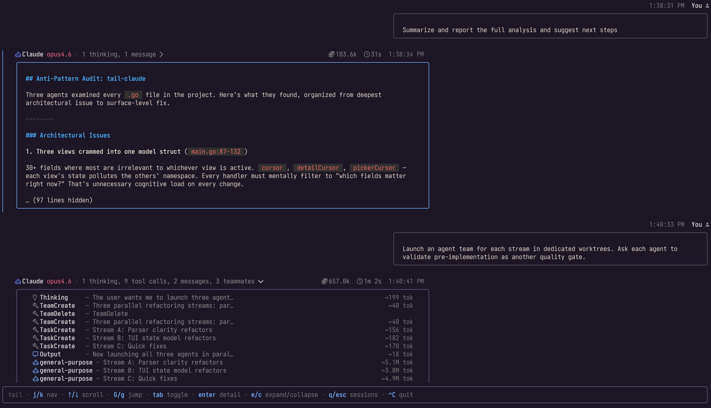

# tail-claude

A terminal UI for reading Claude Code session JSONL files. Built with Go and [Bubble Tea](https://github.com/charmbracelet/bubbletea).

Reads session logs from `~/.claude/` and renders them as a scrollable conversation with expandable tool calls, token counts, and live tailing.

<table>
<tr>
<td></td>
<td></td>
<td></td>
</tr>
<tr>
<td align="center"><sub>Session picker</sub></td>
<td align="center"><sub>Detail view</sub></td>
<td align="center"><sub>Conversation view</sub></td>
</tr>
</table>

## Requirements

- Go 1.25+
- A [Nerd Font](https://www.nerdfonts.com/) patched terminal font

## Install

```bash
go install github.com/kylesnowschwartz/tail-claude@latest
```

Or build from source:

```bash
git clone git@github.com:kylesnowschwartz/tail-claude.git
cd tail-claude
go build -o tail-claude .
```

## Usage

Run `tail-claude` to open the most recent session. If the session is stale (no activity in the last 12 hours), the session picker opens instead so you can choose a session.

Pass a path directly to skip discovery:

```bash
tail-claude ~/.claude/projects/-Users-kyle-Code-foo/session.jsonl
```

### Keybindings

**List view**

| Key | Action |
|-----|--------|
| `j` / `↓` | Move cursor to next message / scroll down 3 lines |
| `k` / `↑` | Move cursor to previous message / scroll up 3 lines |
| `J` / `Ctrl+d` | Scroll viewport down half a page |
| `K` / `Ctrl+u` | Scroll viewport up half a page |
| `G` | Jump to last message |
| `g` | Jump to first message |
| `Tab` | Toggle expand/collapse current message |
| `e` | Expand all Claude messages |
| `c` | Collapse all Claude messages |
| `Enter` | Open detail view for current message |
| `s` | Open session picker |
| `q` / `Esc` | Open session picker |
| `Ctrl+c` | Quit |

**Detail view**

| Key | Action |
|-----|--------|
| `j` / `↓` | Next item (with items) / scroll down 3 lines |
| `k` / `↑` | Previous item (with items) / scroll up 3 lines |
| `J` / `Ctrl+d` | Scroll down half a page |
| `K` / `Ctrl+u` | Scroll up half a page |
| `G` | Jump to last item / scroll to bottom |
| `g` | Jump to first item / scroll to top |
| `Tab` | Toggle expand/collapse current item |
| `Enter` | Drill into subagent / toggle expand |
| `q` / `Esc` | Back to list (or pop subagent stack) |
| `Ctrl+c` | Quit |

**Session picker**

| Key | Action |
|-----|--------|
| `j` / `↓` | Next session |
| `k` / `↑` | Previous session |
| `G` | Jump to last session |
| `g` | Jump to first session |
| `Tab` | Expand/collapse project group |
| `Enter` | Open selected session |
| `q` / `Esc` | Back to list |
| `Ctrl+c` | Quit |

## Attribution

Parsing heuristics ported from [claude-devtools](https://github.com/matt1398/claude-devtools). See [ATTRIBUTION.md](ATTRIBUTION.md).

## License

[MIT](LICENSE)
